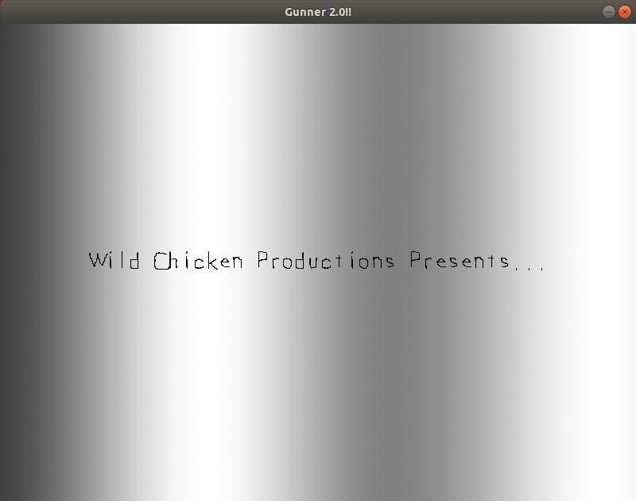
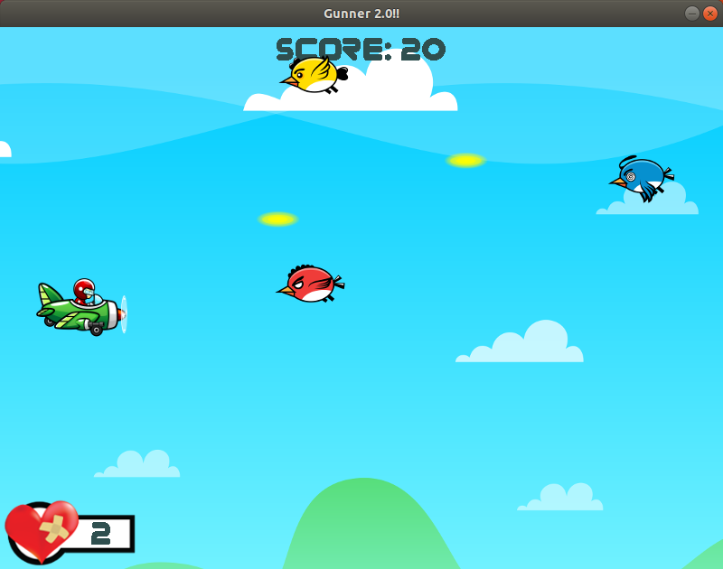

# Skippers-Revenge
2D Shoot-em-up game developed with SDL2 framework



*INTRO*




*GAMEPLAY*

Skipper's Revenge is a 2D shoot-em-up game developed using the SDL2 framework. The game contains all fundamental game mechanics, such as event handling, game logic, rendering, and a simple game state machine to move throughout the different modes/states (e.g., intro, title, levels, etc). I am actually still working on the game, but 'pushed' thus far is what I currently have.  So if you clone this repo you are up-to-date with me.

## Pre-reqs

Requires Make and SDL2:
```
$ sudo apt-get update
$ sudo apt-get install make
```

For those who have Advanced Packaging Tool available (i.e., Ubuntu, Debian, etc), you'll want to search the apt-get cache and find the current SDL2 version to install.  Use the command:
```
$ apt-cache search libsdl2
```
You'll want to download the development version of SDL2, SDL2-image (image file loading library), SDL2-mixer (audio library for sound) and SDL2-ttf (TrueType fonts sample library). As of last update of this README, the development package(s) are libsdl2-dev, libsdl2-image-dev, libsdl2-mixer-dev and libsdl2-ttf-dev.  Use command:
```
$ sudo apt-get install libsdl2-dev libsdl2-image-dev libsdl2-mixer-dev libsdl2-ttf-dev
```

## Cloning, compiling and running

Clone and Compile:
```
$ git clone https://github.com/erick-santiago/Skippers-Revenge.git
$ cd Skippers-Revenge
$ make
```

Run:
```
$ ./testing_SR
```
The media is included in the `Media` directory.

## Keyboard Controls

`D` - shoot

`R` - To replay game, after a gameover

`Arrow keys` - To move up, down, left and right

## Tested With
Linux Mint 18.3 Sylvia
Linux Ubuntu 18.04 Bionic

## References
Resources used to bring this project to life, and special thanks:

- https://lazyfoo.net/tutorials/SDL/

## License
This project is licensed under the terms of the MIT license.
